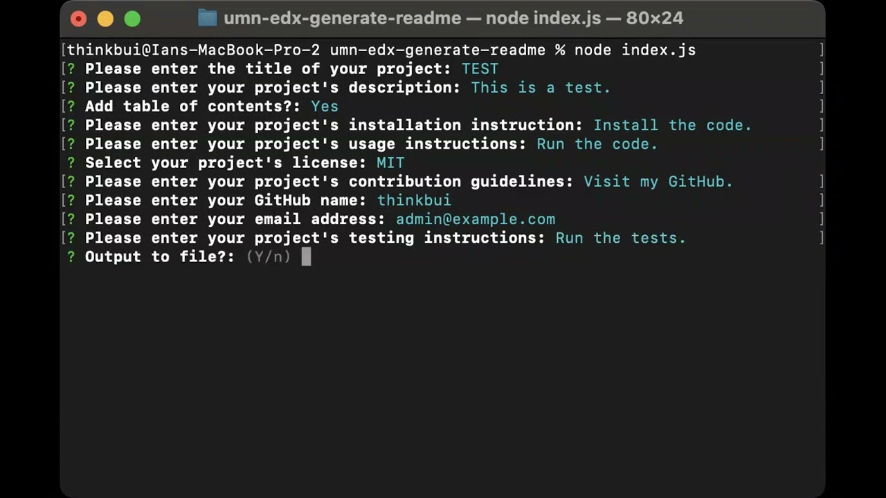

# umn-edx-generate-readme

## SUMMARY
This is a basic README generator that creates content in the Markdown language.  It prompts the user with a series of questions for information needed to fill the README, then structures it in a standard, professional format.  The user has a choice between having that content printed to the console or output to a file named *OUTPUT.md*.

For any of the prompts for descriptions, instructions, and guidelines, you can type in Markdown-formatted text.  It is recommended that you **not** use Markdown for the title, your GitHub name, or your email address as it may lead to unexpected results.

## INSTALLATION & USAGE
This project is built with Node.JS.  You will need to have that installed before you begin.
1. Clone the project to your machine.
2. From your terminal, run 'npm install'.
3. To run the project, run 'node index.js'.

## NOTES
The prompts use the Inquirer.JS package and asks sequentially.  With the exception of *Table of Contents*, all sections are to be displayed.  Perhaps in the future, the prompts could be updated to include the ability to skip certain sections (ex. *Installation* for an HTML/CSS project), but for now any undesired sections should be removed manually from the output.

If no license is selected, neither a badge nor the license section will be rendered.  Also the selection of licenses is currently limited, but that can be expanded later.

## DEMOS
Below are links to videos demonstrating the usage of this project.  They are also available as WEBM videos and GIF animations in this repository.

[Generating to File](https://www.youtube.com/watch?v=wrKO0HJLGvg)

[Generating to Console](https://www.youtube.com/watch?v=b-qo3kvrpnk)

[Example Output](./EXAMPLE_OUTPUT.md)

